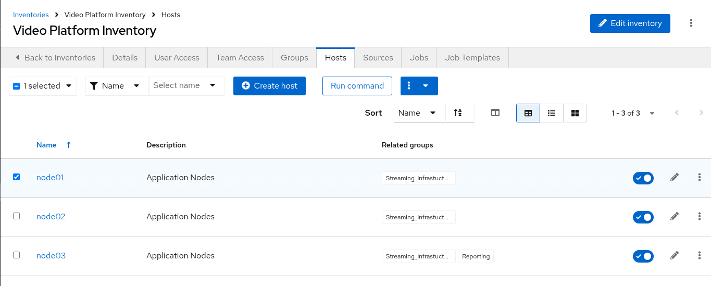
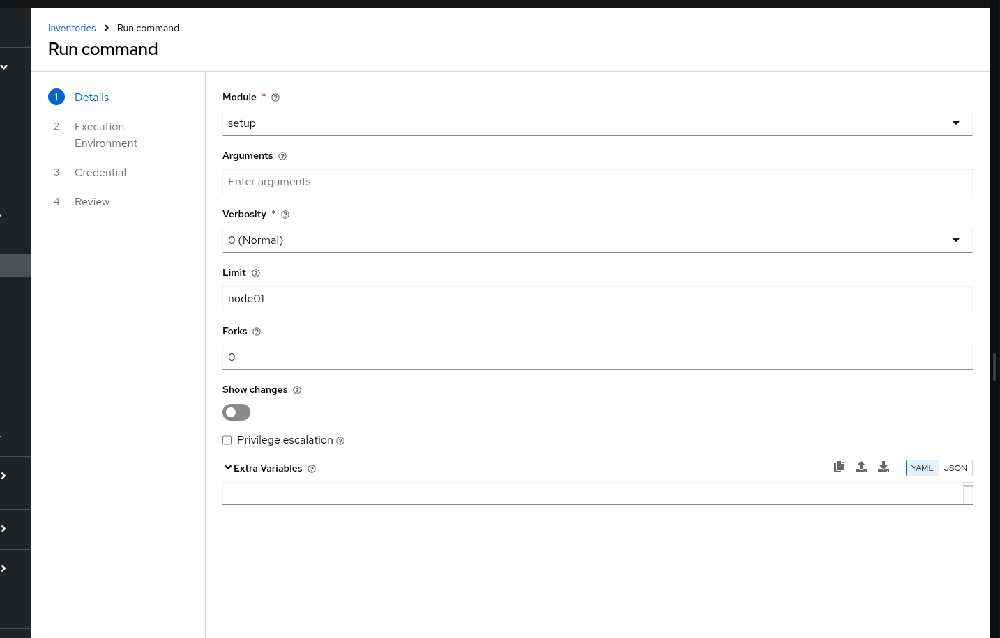
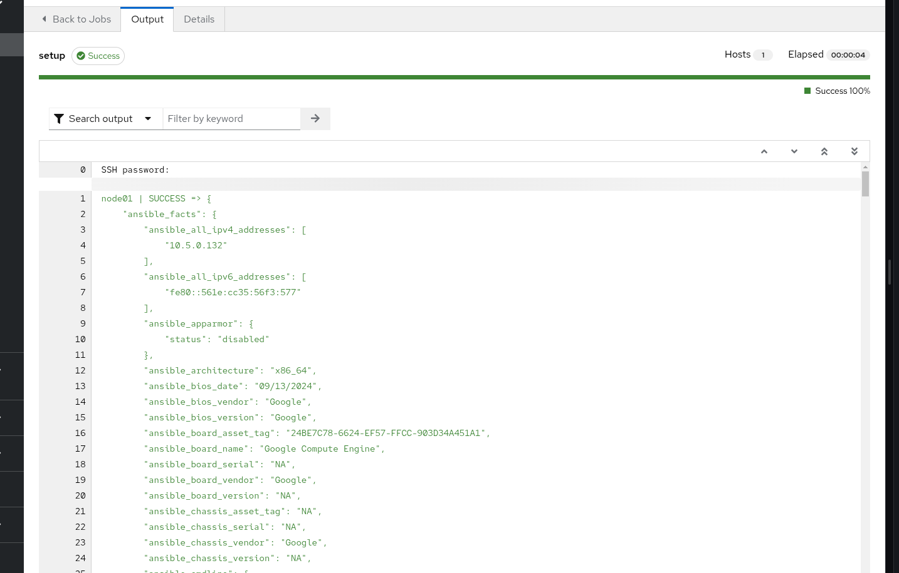
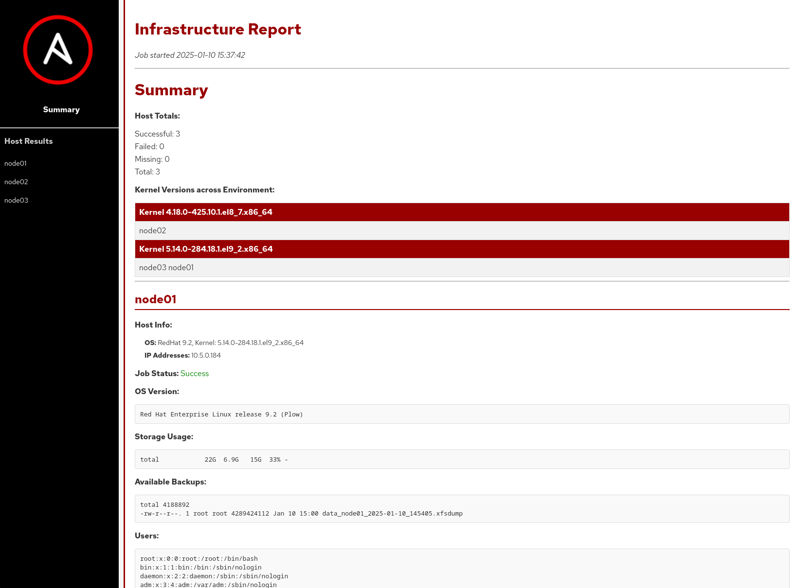
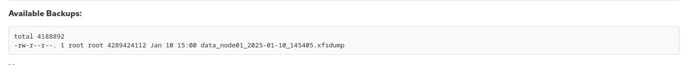
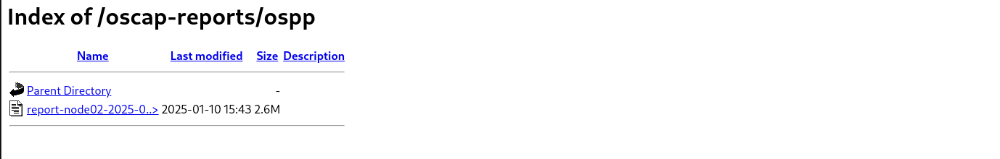
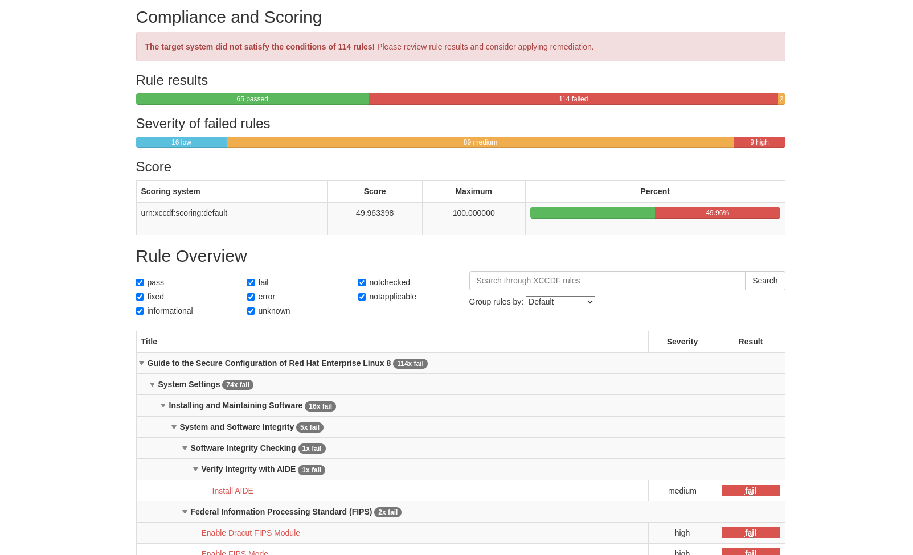

= Lab Guide: Infrastructure Introspection and Reporting
:notoc:
:toc-title: Table of Contents
:sectnums:
:icons: font

_A guide to using Ansible Automation Platform to gather data and generate dynamic reports about your infrastructure._

---

== Scenario: Introspection

Sometimes you just need data about your systems. Ansible excels at gathering infrastructure data at scale, making it easy to audit your servers, network devices, and more. This is a great, low-risk way to begin your automation journey.

First, log into the Ansible Automation Platform instance using the credentials below.

.Login Credentials
[cols="1,2a"]
|===
| Username | `admin`
| Password | `ansible123!`
|===

---

== Gathering Server Facts with Ad-Hoc Commands

Let's start by gathering detailed information, or "facts," from a single server using an ad-hoc command.

. **Navigate to the inventory.**
+
In the lab's `aap` tab, log in and navigate to **Automation Execution** → **Infrastructure** → **Inventories**. Select the **Video Platform Inventory**, then click the **Hosts** tab.
+

. **Run an ad-hoc command on `node01`.**
+
Select the checkbox next to the host `node01` and click the **Run command** button. A wizard will appear to guide you through the configuration.

. **Configure the ad-hoc command.**
+
Fill out the wizard prompts as follows:
+
--
a. *Module:* From the dropdown list, select the `setup` module. This module gathers facts about a remote host. Click **Next**.
+

+
b. *Execution Environment:* Select the **Default execution environment**. Click **Next**.
c. *Credentials:* Select the **Application Nodes** credential. Click **Next**, then click **Finish**.
--

. **Review the output.**
+
Once the command finishes, the output will display a large JSON object containing all the system facts Ansible was able to gather from `node01`.
+

---

== Generating Dynamic Infrastructure Reports

Gathering raw facts is useful, but we can also use Ansible and Jinja2 templates to create dynamic, easy-to-read HTML reports.

. **Generate the application server report.**
+
Navigate to **Automation Execution** → **Templates** and launch the **Application Server Report** job template.

. **Select a report filter.**
+
The template will prompt you with a survey. For now, select **All** to generate a report for all servers.

. **View the report.** (Images might change depending on versions)
+
Once the job completes, navigate to the **Report Server tab** in your lab environment and refresh the page. You will see a newly generated report.
+

+
Notice that the report can combine information from multiple sources, including the backup status of the servers.
+

---

== Running a Security Compliance (OpenSCAP) Report

Automation is a powerful tool for security and compliance. Let's run a pre-configured job that uses OpenSCAP to generate a compliance report for one of our servers.

. **Generate the OpenSCAP report.**
+
Navigate to **Automation Execution** → **Templates** and launch the **OpenSCAP Report** job template. Security has requested a report for `Node02`, which this template is configured to scan.

. **View the report summary.**
+
Once the job completes, navigate to the **Compliance Report tab**. You will see a folder containing the newly generated report.
+

. **View the detailed report.**
+
Click on the HTML file to open the full OpenSCAP report and view the detailed compliance results.
+

---

== Appendix: OpenSCAP Code Snippets

If you're interested, here are some key code snippets from the OpenSCAP playbook.

[source,yaml]
----
tasks:
- name: Check if the system is RHEL 8
  ansible.builtin.debug:
    msg: "This playbook is not compatible with {{ inventory_hostname }} (not RHEL 8)"
  when: ansible_distribution != "RedHat" or ansible_distribution_major_version != "8"
  failed_when: false

- name: Run compliance tasks on RHEL 8 systems only
  when: ansible_distribution == "RedHat" and ansible_distribution_major_version == "8"
  block:
    - name: Get our facts straight
      ansible.builtin.set_fact:
        _profile: '{{ compliance_profile | replace("pci_dss", "pci-dss") }}'
        _report_dir: /tmp/oscap-reports

    - name: Ensure OpenSCAP tools are installed
      ansible.builtin.dnf:
        name: '{{ openscap_packages }}'
        state: present

    - name: Configure httpd
      when: use_httpd | bool
      block:
        - name: Install httpd
          ansible.builtin.dnf:
            name: httpd
            state: present
          notify: Restart httpd
        # ... (additional httpd and firewalld configuration)

    - name: Create report on Report Server
      block:
        - name: Ensure report directory exists
          ansible.builtin.file:
            path: '{{ _report_dir }}/{{ _profile }}'
            state: directory
            mode: 0755

        - name: Generate compliance report
          ansible.builtin.command: >-
            oscap xccdf eval --profile {{ _profile }} --report {{ _report }}
            /usr/share/xml/scap/ssg/content/ssg-rhel{{ ansible_distribution_major_version }}-ds.xml
          args:
            creates: '{{ _report }}'
          register: _oscap
          failed_when: _oscap.rc not in [0, 2]
----
